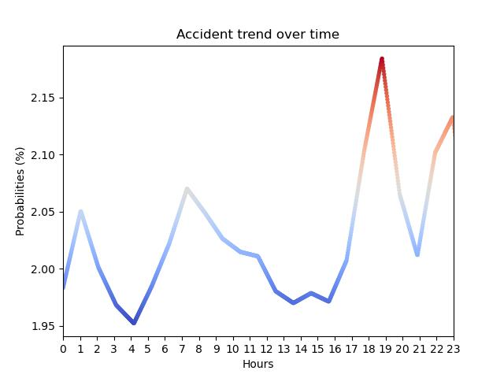

## Introduction to the API

### Overview
The Accident Prediction API is a machine learning-based service that predicts the probability of accidents occurring in Berlin based on various input parameters such as district, time of day, day of the week, lighting conditions, and road conditions. It offers endpoints for retrieving accident probability predictions and generating visual representations of accident trends.

### Endpoints
1. `/probability`: Predicts the probability of accidents occurring based on provided data inputs.
2. `/day`: Generates a graph depicting accident probabilities over a day based on provided data inputs.
3. `/image`: Generates a heatmap image depicting accident probability by district based on provided data inputs.

### Features
- **Accident Probability Prediction**: The API provides accurate predictions of accident probabilities, helping users make informed decisions and take preventive measures.
- **Graphical Representation**: Users can visualize accident trends over time and by district, aiding in identifying patterns and understanding accident occurrences better.
- **Flexible Inputs**: Users can specify various parameters such as district, time, day, lighting conditions, and road conditions to tailor predictions to specific scenarios.
- **Error Handling**: The API handles invalid input data gracefully, returning appropriate error responses to guide users.

### Getting Started
To start using the Accident Prediction API, send POST requests to the respective endpoints with the required input parameters in JSON format. The API will process the requests and return the predicted accident probabilities or graphical representations.

## Machine Learning Model

### Overview
The Accident Prediction API utilizes a machine learning model to predict the probability of accidents occurring in Berlin based on various input parameters. The model is trained on historical accident data collected from different districts of Berlin, considering factors such as time of day, day of the week, lighting conditions, and road conditions.

### Model Training
- **Data Collection**: The model training dataset is collected from real-world accident reports in Berlin. This dataset includes information such as accident location (district), time of day, day of the week, lighting conditions, road conditions, and the number of accidents.
- **Feature Engineering**: Features such as district, hour, day of the week, lighting condition, and road condition are extracted from the dataset and transformed into a format suitable for training the machine learning model.
- **Model Selection**: Initially, a RandomForestRegressor model is chosen for its ability to handle non-linear relationships and capture interactions between features effectively.
- **Hyperparameter Tuning**: Hyperparameters of the RandomForestRegressor model are fine-tuned using GridSearchCV. The grid search explores various combinations of hyperparameters, such as the number of estimators, maximum depth, minimum samples split, and more, to find the optimal configuration that minimizes mean squared error (MSE) and improves the model's predictive performance.
- **Training Process**: The model is trained using the collected dataset, with features as inputs and the number of accidents as the target variable. The dataset is split into training and testing sets to evaluate the model's performance.

### Model Evaluation
- **Performance Metrics**: The model's performance is evaluated using Mean Squared Error (MSE) and coefficient of determination (R^2). These metrics help assess how well the model generalizes to unseen data and predicts accident probabilities accurately.

### Model Deployment
- **Serialization**: Once trained, the model with the best hyperparameters is serialized using pickle to save its state to a file.
- **Integration with API**: The serialized model file is integrated into the Accident Prediction API, allowing users to make predictions on accident probabilities by sending requests to the `/probability` endpoint.

### Continuous Improvement
- **Data Updates**: The model can be periodically retrained with updated accident data to adapt to changing patterns and trends.
- **Feedback Loop**: User feedback and real-world observations can be used to refine the model and enhance its predictive capabilities over time.

### Conclusion
The hyperparameter-tuned machine learning model forms the core of the Accident Prediction API, providing accurate predictions of accident probabilities based on historical data. By leveraging advanced algorithms and continuous improvement strategies, the API aims to assist stakeholders in reducing the frequency and severity of accidents in Berlin, ultimately contributing to enhanced safety and well-being in the community.


## Endpoint: `/probability`

### Description
This endpoint predicts the probability of an accident occurrence based on provided data inputs.

### Method
- **POST**

### Parameters
- `mode` (string): how the response is given. ("percentage","number")

### Request Body
- **Content Type:** JSON
- **Parameters:**
  - `district` (integer): The district number where the accident might occur. (1-12)
  - `hour` (integer): The hour of the day when the accident might occur. (0-23)
  - `day` (integer): The day of the week when the accident might occur. (1-7)
  - `light` (integer): The lighting condition during the accident. (0-2)
  - `condition` (integer): The road condition during the accident. (0-2)

### Response
- **Content Type:** Plain text
- **Body:**
  - If successful:
    - For `mode=percentage`: Returns the predicted probability as a percentage value.
    - For `mode=number`: Returns the predicted number of accidents.
  - If unsuccessful:
    - HTTP Status Code 400: Invalid mode specified.
    - HTTP Status Code 422: Invalid input data provided.

### Sample Request
```json
{
  "district": 5,
  "hour": 15,
  "day": 3,
  "light": 1,
  "condition": 2
}
```
### Sample Response
- For mode = percentage: 0.015
- For mode = number: 1.78

### Error Response
- **HTTP Status Code 400:** Invalid mode specified
- **HTTP Status Code 422:** Invalid input data provided.


## Endpoint: `/image`

### Description
This endpoint generates a heatmap image depicting accident probability by district based on provided data inputs.

### Method
- **POST**

### Request Body
- **Content Type:** JSON
- **Parameters:**
  - `hour` (integer): The hour of the day when the accident might occur. (0-23)
  - `day` (integer): The day of the week when the accident might occur. (1-7)
  - `light` (integer): The lighting condition during the accident. (0-2)
  - `condition` (integer): The road condition during the accident. (0-2)

### Response
- **Content Type:** Image (JPEG)
- **Body:** Image data

### Sample Request
```json
{
  "hour": 15,
  "day": 3,
  "light": 1,
  "condition": 2
}
```
### Sample Response


### Error Response
- **HTTP Status Code 422:** Invalid input data provided.


## Endpoint: `/day`

### Description
This endpoint generates a graph depicting accident probabilities over a day based on provided data inputs.

### Method
- **POST**

### Request Body
- **Content Type:** JSON
- **Parameters:**
  - `district` (integer): The district number where the accident might occur. (1-12)
  - `day` (integer): The day of the week when the accident might occur. (1-7)
  - `light` (integer): The lighting condition during the accident. (0-2)
  - `condition` (integer): The road condition during the accident. (0-2)

### Response
- **Content Type:** Image (JPEG)
- **Body:** Image data

### Sample Request
```json
{
  "district": 2,
  "day": 3,
  "light": 1,
  "condition": 2
}
```
### Sample Response


### Error Response
- **HTTP Status Code 422:** Invalid input data provided.


## How to test the API
- 1) Import the anaconda environment and download all the dependencies with "conda env create -n Hackathon --file environment.yml", this will also automatically install all the dependencies.
- 2) Activate the anaconda environment with "conda activate Hackathon".
- 3) Run the Flask app with "flask --app router run" in the base directory.
- 4) Enjoy your testing.